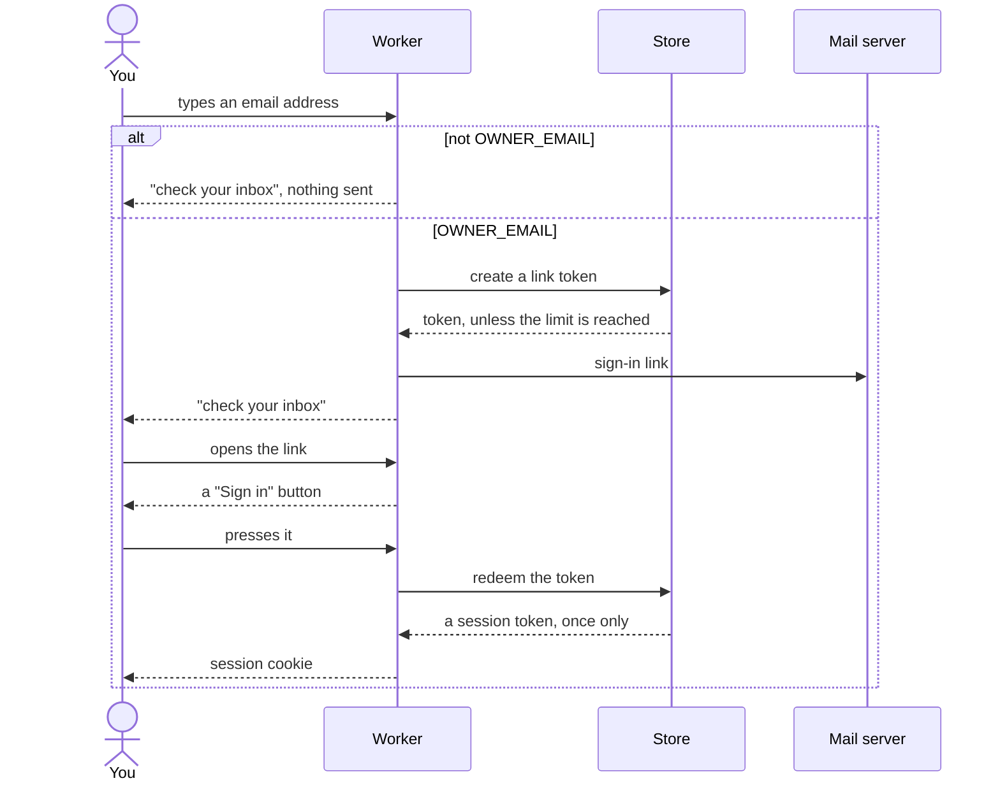
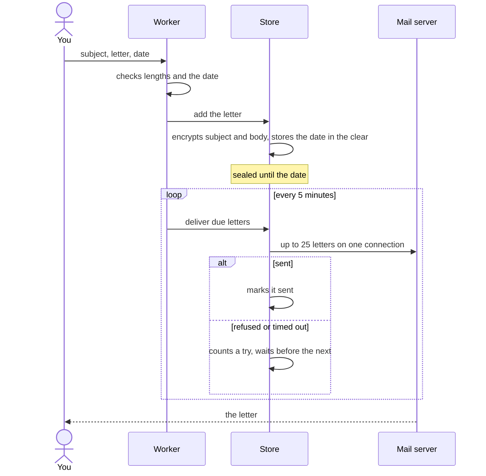

# Someday architecture

Someday is one Cloudflare Worker and one Durable Object in the owner's Cloudflare account. The Worker serves the pages and runs a cron trigger every 5 minutes. Cloudflare serves the two browser scripts as static assets from the same deploy. The Durable Object, called the store, holds an SQLite database with the letters, the sign-in tokens, the owner's settings and the encryption key, and it sends due letters through the owner's own SMTP server over a TCP socket. No other Cloudflare product and no email service is involved.

## The parts

| Part | File | What it does |
|---|---|---|
| Worker | `src/index.ts` | matches the route table, refuses form posts from other sites, checks the session cookie, and calls the store; the cron trigger starts a delivery pass every 5 minutes |
| Routes | `src/routes/` | sign-in, sign-out, writing, listing, opening and deleting letters, settings, and backup download and restore |
| Pages | `src/pages/` | one file per screen, built with an `html` template tag that escapes every value unless it is already markup, and one shared stylesheet that the owner's settings adjust |
| Browser scripts | `src/client/` | the write page's date handling and the delete confirmation, bundled by esbuild into `public/js/` at deploy time |
| Store | `src/store.ts` | the one Durable Object, named `main`; owns the database and hands each call to a module below |
| Letters | `src/letters.ts` | the `letters` table: add, list, open delivered ones, find due ones, mark sent or failed |
| Sessions | `src/sessions.ts` | the `tokens` table: one-time sign-in links and 400-day sessions, stored as SHA-256 hashes |
| Settings | `src/settings.ts` | the `settings` table: theme, typeface, text size, accent colour, custom CSS, and the defaults for new letters |
| Backups | `src/backup.ts` | builds the backup file, checks and restores an uploaded one, and emails one to the owner every 30 days; the `backup_schedule` table holds the next date |
| Cipher | `src/cipher.ts` | the `cipher_key` table and AES-256-GCM for letter subjects and bodies |
| Delivery | `src/delivery.ts` | sends up to 25 due letters over one SMTP connection and records each result |
| Mail | `src/mail.ts` | an SMTP client on Workers TCP sockets: TLS on 465, STARTTLS on other ports, AUTH PLAIN, base64 bodies |

## Signing in

Anyone can open the site, but only the address in `OWNER_EMAIL` is ever sent a sign-in link. Any other address gets the same "check your inbox" page and no email.

The link only shows a button, and the button spends the token. Mail scanners that open links therefore do not use up the link.

The store makes at most one link a minute and ten a day. Over the limit, the page is the same as for any other address, so the limit does not reveal which address is the owner's. Anyone who knows that address can use up the ten links for the day; the owner then waits up to a day for a new link, and browsers already signed in stay signed in. If the sign-in email cannot be sent, the link is deleted and does not count toward the limit.

## A letter from the form to the inbox

The browser turns the chosen date into 9:00 local time and sends the time zone along with it. Without JavaScript the server uses 9:00 UTC. Upcoming letters show only their subject and date; a letter can be opened once it has been delivered.

## Pages and settings

Every page carries a Content-Security-Policy that allows scripts only from the site's own `/js/` files and styles only from the style element marked with a random nonce made for that response. Text from a letter or a setting that ends up in the page cannot run code. Form posts whose `Sec-Fetch-Site` header is anything other than `same-origin` or `none` get a 403.

The owner's settings are written into the page's style element as custom properties (`--font`, `--size`, `--accent`), followed by the custom CSS with every `<` escaped as `\3c ` so the CSS cannot close the element. The settings page leaves the custom CSS out, so a stylesheet that hides the page can still be removed there.

## What the store keeps

| Table | Columns | Notes |
|---|---|---|
| `letters` | `id`, `sealed`, `tz`, `created_at`, `deliver_at`, `sent_at`, `retry_at`, `attempts`, `last_error` | `sealed` is a 12-byte IV followed by the AES-GCM ciphertext of the subject and body |
| `tokens` | `hash`, `kind`, `created_at`, `expires_at` | `kind` is `link` or `session`; tokens themselves are never stored |
| `settings` | `id`, `json` | one row; read over the built-in defaults, so a setting added in a later version starts at its default |
| `backup_schedule` | `id`, `next_at` | one row; when the next backup email is due |
| `cipher_key` | `id`, `aes_key` | one row, written the first time the store starts |

Each module creates its own table with `CREATE TABLE IF NOT EXISTS` when the store starts, so a deploy has no migration step. IDs are ULIDs and times are Unix seconds.

The key sits in the same database as the letters. It protects a leaked copy of the data, and does not protect against someone who can sign in to the Cloudflare account.

## Background work

| Job | How often |
|---|---|
| Send due letters, up to 25 per run | every 5 minutes |
| Retry a failed letter | 5 minutes after the first failure, then 10, 20, 40, up to once a day, with no limit on tries |
| Delete tokens that expired over a day ago | every 5 minutes, before sending |
| Email a backup to the owner | on the first pass after the first letter exists, then every 30 days; a failed send is tried again a day later; off when the owner turns it off in Settings |

A delivery pass that starts while another is still running joins the running one, so overlapping cron runs never send a letter twice. If the connection or the login fails, every due letter in the batch is marked failed with the server's reply, which shows on the letters page. If the server refuses one letter, only that letter is marked failed and the pass stops; the others go out on the next pass. If a secret is empty or an address is malformed, the due letters are marked failed with the name of the secret. A letter that can no longer be decrypted is marked failed and left out of every batch.

## Limits

| What | Limit |
|---|---|
| Subject | 200 characters |
| Letter | 100,000 characters |
| Delivery date | any time after now, up to 100 years ahead; the date picker starts at tomorrow |
| Sign-in link | works once, for 15 minutes |
| Sign-in links sent | one a minute, ten a day |
| Session | 400 days |
| SMTP reply | 20 seconds before the attempt fails |
| Letters sent | 25 every 5 minutes; the mail provider's own limit is lower, for example 500 a day for a personal Gmail account |
| Greeting, subject start | 200 and 100 characters |
| Prompts | 20, of up to 200 characters each |
| Custom CSS | 20,000 characters |

On the Workers free plan the cron trigger uses one of the five allowed per account and runs 288 times a day. Each page view makes one or two calls to the store.

## Backups

A backup is one JSON file with `format: "someday-backup"`, `version: 1`, the settings, and every letter with its ID, subject, body, time zone and three ISO 8601 dates: `written`, `deliver`, and `delivered` (null while sealed). Letters are in plain text, so the file can be read without Someday and without the encryption key.

The owner gets one by email every 30 days and can download one from Settings at any time. Restore on the Settings page checks the file before it changes anything: every letter must have a 26-character ID, a subject of up to 200 characters, a body of up to 100,000 characters and valid dates, or nothing is restored. Letters are encrypted again with this instance's key. A letter whose ID already exists is skipped, so restoring the same file twice adds nothing. The backup's settings replace the current ones. A sealed letter whose date passed while it was away is sent on the next delivery pass.

The whole backup goes in one attachment. Gmail refuses messages over 25 MB, which is about 18 MB of letters.
