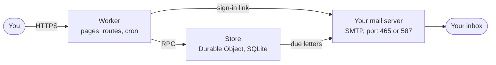
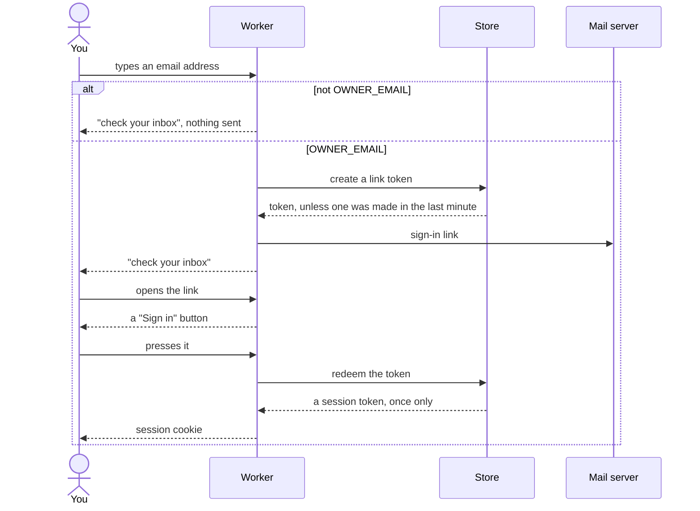
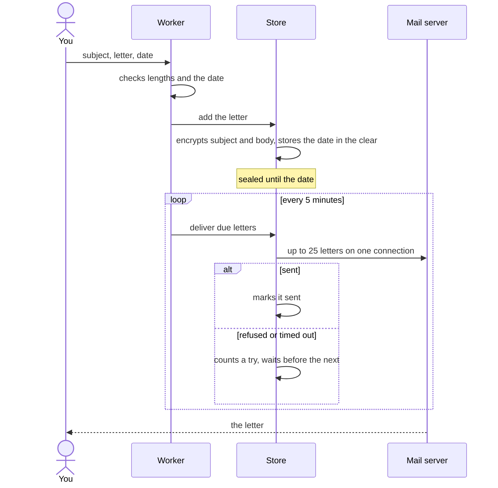

# Someday architecture

Someday is one Cloudflare Worker and one Durable Object in the owner's Cloudflare account. The Worker serves the pages and runs a cron trigger every 5 minutes. The Durable Object, called the store, holds an SQLite database with the letters, the sign-in tokens and the encryption key, and it sends due letters through the owner's own SMTP server over a TCP socket. No other Cloudflare product and no email service is involved.

## The parts

| Part | File | What it does |
|---|---|---|
| Worker | `src/index.ts` | matches the route table, checks the session cookie, and calls the store; the cron trigger starts a delivery pass every 5 minutes |
| Routes | `src/routes/` | sign-in, sign-out, and writing, listing, opening and deleting letters |
| Pages | `src/pages/` | HTML built as strings, one file per screen, with one shared stylesheet |
| Store | `src/store.ts` | the one Durable Object, named `main`; owns the database and hands each call to a module below |
| Letters | `src/letters.ts` | the `letters` table: add, list, open delivered ones, find due ones, mark sent or failed |
| Sessions | `src/sessions.ts` | the `tokens` table: one-time sign-in links and 400-day sessions, stored as SHA-256 hashes |
| Cipher | `src/cipher.ts` | the `cipher_key` table and AES-256-GCM for letter subjects and bodies |
| Delivery | `src/delivery.ts` | sends up to 25 due letters over one SMTP connection and records each result |
| Mail | `src/mail.ts` | an SMTP client on Workers TCP sockets: TLS on 465, STARTTLS on other ports, AUTH PLAIN, base64 bodies |

## Signing in

Anyone can open the site, but only the address in `OWNER_EMAIL` is ever sent a sign-in link. Any other address gets the same "check your inbox" page and no email.

The link only shows a button, and the button spends the token. Mail scanners that open links therefore do not use up the link.

## A letter from the form to the inbox

The browser turns the chosen date into 9:00 local time and sends the time zone along with it. Without JavaScript the server uses 9:00 UTC. Upcoming letters show only their subject and date; a letter can be opened once it has been delivered.

## What the store keeps

| Table | Columns | Notes |
|---|---|---|
| `letters` | `id`, `sealed`, `tz`, `created_at`, `deliver_at`, `sent_at`, `retry_at`, `attempts`, `last_error` | `sealed` is a 12-byte IV followed by the AES-GCM ciphertext of the subject and body |
| `tokens` | `hash`, `kind`, `created_at`, `expires_at` | `kind` is `link` or `session`; tokens themselves are never stored |
| `cipher_key` | `id`, `aes_key` | one row, written the first time the store starts |

Each module creates its own table with `CREATE TABLE IF NOT EXISTS` when the store starts, so a deploy has no migration step. IDs are ULIDs and times are Unix seconds.

The key sits in the same database as the letters. It protects a leaked copy of the data, and does not protect against someone who can sign in to the Cloudflare account.

## Background work

| Job | How often |
|---|---|
| Send due letters, up to 25 per run | every 5 minutes |
| Retry a failed letter | 5 minutes after the first failure, then 10, 20, 40, up to once a day, with no limit on tries |
| Delete tokens that expired over a day ago | every 5 minutes, before sending |

A delivery pass that starts while another is still running joins the running one, so overlapping cron runs never send a letter twice. When a send fails, that letter and the rest of the batch are marked failed with the server's reply, which shows on the letters page.

## Limits

| What | Limit |
|---|---|
| Subject | 200 characters |
| Letter | 100,000 characters |
| Delivery date | any time after now, up to 100 years ahead; the date picker starts at tomorrow |
| Sign-in link | works once, for 15 minutes |
| Sign-in links sent | one a minute, ten a day |
| Session | 400 days |
| SMTP reply | 20 seconds before the attempt fails |
| Letters per day | 7,200 (25 every 5 minutes) |

On the Workers free plan the cron trigger uses one of the five allowed per account and runs 288 times a day. Each page view makes one or two calls to the store.
